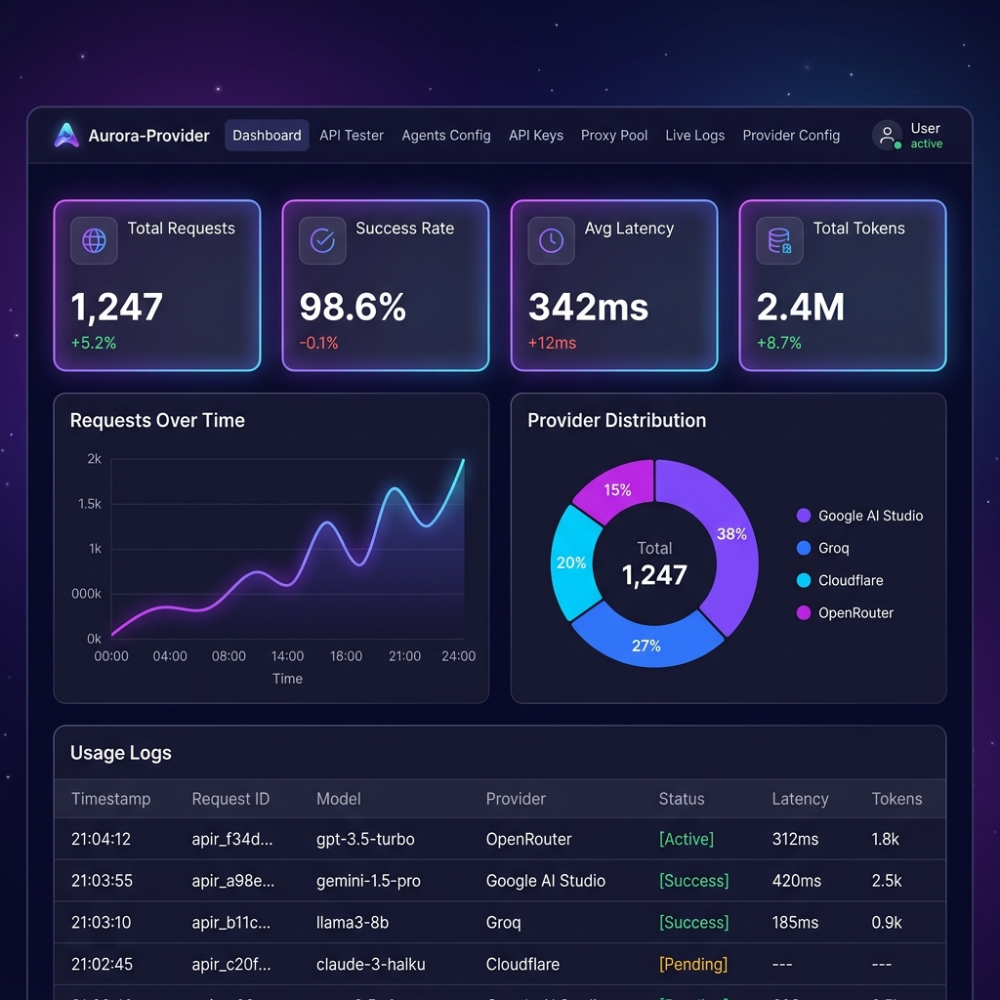

<p align="center">
  <h1 align="center">🌌 Aurora-Provider</h1>
  <p align="center">
    <strong>Local OpenAI-compatible LLM router — one endpoint, unlimited free fallback chains, zero rate limits.</strong>
  </p>
  <p align="center">
    <a href="LICENSE"></a>
    <a href="https://nodejs.org"></a>
    <a href="https://bun.sh"></a>
    <a href="https://github.com/ahmed-zhran/aurora-provider/stargazers"></a>
  </p>
</p>

---

Aurora-Provider runs as a tiny local server and exposes an **OpenAI-compatible API**. Point any AI tool at it and get:

- 🔄 **Never hit a rate limit again** — automatic key rotation + provider failover across 11+ free LLM providers
- 📊 **Full analytics dashboard** — real-time logs, usage charts, key health monitoring, proxy pool management
- 🔌 **Drop-in compatible** — works with Cursor, Aider, Continue, or any OpenAI SDK client

<p align="center">
  
</p>

---

## ⚡ Quick Start

```bash
# 1. Clone
git clone https://github.com/ahmed-zhran/aurora-provider.git
cd aurora-provider

# 2. Install
bun install    # or: npm install

# 3. Configure API keys
cp vault/keys.example.json vault/keys.json
# Edit vault/keys.json with your free API keys (see "Getting API Keys" below)

# 4. Start
bun run start  # or: npm start
```

You should see:

```
╔══════════════════════════════════════════╗
║          Aurora-Provider  v1.0.0         ║
║  Local OpenAI-compatible LLM router     ║
╠══════════════════════════════════════════╣
║  Listening: http://127.0.0.1:8550       ║
║  Agents:    plan, build, coder, ...     ║
╚══════════════════════════════════════════╝
```

Dashboard: **http://127.0.0.1:8550** · API: **http://127.0.0.1:8550/v1/chat/completions**

---

## 🤔 How It Works

When a request comes in for model `aurora-provider/coder`, Aurora-Provider:

1. Resolves the **agent** (`coder`) and loads its ordered **fallback chain**
2. Picks the **first available provider** and tries its API keys
3. On rate-limit (429) → rotates to the **next API key** for that provider
4. All keys exhausted → falls to the **next provider** in the chain
5. Routes through **SOCKS5 proxies** to bypass IP-level rate limits
6. Every 15 minutes, **probes all keys** in the background and resets recovered ones

### Architecture

```
Cursor / Aider / Continue / Any Client
  │
  │  POST /v1/chat/completions
  │  model: "aurora-provider/coder"
  ▼
┌─────────────────────────────────────────────────────┐
│                    Aurora-Provider                   │
│                                                     │
│  1. Resolve model name → agent ("coder")            │
│  2. Load fallback chain from agents.json            │
│  3. For each (provider, model) in chain:            │
│     a. Get next available key (skip rate-limited)   │
│     b. Route through SOCKS5 proxy pool              │
│     c. Forward request to provider API              │
│     d. On 429 → rotate key → rotate proxy → retry   │
│     e. All keys exhausted → next provider           │
│  4. Return upstream response (streaming supported)  │
│                                                     │
│  Background: proxy pool auto-refresh + key probing  │
└─────────────────────────────────────────────────────┘
  │
  ├── Google AI Studio → gemini-2.5-flash (1M context)
  ├── Groq             → llama-3.3-70b (ultra fast)
  ├── Cloudflare AI    → kimi-k2.6 (262K context)
  ├── OpenRouter       → 30+ free models
  ├── Zhipu            → glm-4.7-flash (200K context)
  └── ... 6 more providers
```

### Two-Layer Fallback

```
Request for agent "coder"
  │
  Layer 1: Key Rotation
  ├── openrouter / kimi-k2.6
  │   ├── key[0] → 429 → mark, try key[1]
  │   ├── key[1] → 429 → all exhausted → next provider
  │
  Layer 2: Provider Fallback
  ├── cloudflare / kimi-k2.6 → success ✓
  │
  Done.
```

---

## 📊 Dashboard

Aurora-Provider includes a full-featured web dashboard with **5 themes** (Deep Space, Light Mode, Cyberpunk, Aurora, Ocean):

| Tab | What It Does |
|-----|-------------|
| **Dashboard** | KPI cards, request charts, usage logs with filtering |
| **API Tester** | Test any agent directly from the browser |
| **Agents Config** | Drag-and-drop fallback chain editor |
| **API Keys & Health** | Live key status with cooldown timers |
| **Proxy Pool** | SOCKS5 proxy management with source rankings |
| **Live Logs** | Real-time server logs via SSE |
| **Provider Config** | Full CRUD for provider definitions |

---

## 🛠️ Configuration

Aurora-Provider uses three JSON config files in the `vault/` directory:

### API Keys (`vault/keys.json`)

Add as many keys per provider as you have — more keys = more resilience:

```json
{
  "keys": {
    "google_ai_studio": ["AIza-key1", "AIza-key2"],
    "groq": ["gsk_key1"],
    "openrouter": ["sk-or-key1"],
    "cloudflare_workers_ai": [
      { "apiToken": "your-cf-token", "accountId": "your-account-id" }
    ]
  }
}
```

> **Providers with no keys configured are automatically skipped.** You don't need all providers — even just 2-3 gives solid coverage.

### Agent Fallback Chains (`vault/agents.json`)

Each agent has an ordered fallback chain. Customize priorities by reordering:

| Agent | Role | Default Chain |
|-------|------|--------------|
| **plan** | Orchestration | OpenCode Zen → Cloudflare → OpenRouter → Gemini |
| **build** | Delegation | Same as plan |
| **coder** | Implementation | OpenCode Zen → Cloudflare → OpenRouter → Zhipu → Gemini |
| **explore** | Analysis | OpenCode Zen → OpenRouter → Gemini → Groq |
| **researcher** | Research | OpenCode Zen → OpenRouter → Cloudflare → Gemini |
| **scribe** | Documentation | OpenCode Zen → Gemini → OpenRouter → Groq |
| **reviewer** | Code review | OpenCode Zen → Cloudflare → OpenRouter → Zhipu → Gemini |

### Provider Registry (`vault/providers.json`)

Defines API endpoints, auth methods, models, and rate limit behavior. See [docs/providers-guide.md](docs/providers-guide.md) for details.

---

## 🌐 Supported Providers

All providers offer **completely free** tiers — no credit card required:

| Provider | Free Models | Context | Rate Limits | Speed |
|----------|-------------|---------|-------------|-------|
| [**Google AI Studio**](https://aistudio.google.com) | Gemini 2.5 Flash | 1M | 30 RPM / 1,500 RPD | Fast |
| [**Groq**](https://console.groq.com) | Llama 3.3 70B, Llama 4 Scout | 128K–512K | 30 RPM / 1K RPD | Ultra fast |
| [**Cloudflare Workers AI**](https://dash.cloudflare.com) | Kimi K2.6, Qwen3, DeepSeek R1 | 262K–512K | 10K neurons/day | Medium |
| [**OpenRouter**](https://openrouter.ai) | 30+ free models | up to 1M | ~20 RPM | Medium |
| [**Zhipu (Z.AI)**](https://open.bigmodel.cn) | GLM-4.7 Flash | 200K | 1 concurrent | Fast |
| [**OpenCode Zen**](https://opencode.ai/zen) | Big Pickle, DeepSeek V4 Flash | 200K | Generous | Medium |
| [**Cerebras**](https://cloud.cerebras.ai) | Llama 3.3 70B | 8K–131K | 1M tok/day | Ultra fast |
| [**NVIDIA NIM**](https://build.nvidia.com) | 94+ models | 32K–262K | ~5 RPM | Fast |
| [**GitHub Models**](https://github.com/marketplace/models) | Grok 3, Llama 3.3 70B | 128K | 8K in / 4K out | Fast |
| [**LLM7.io**](https://token.llm7.io) | DeepSeek R1, Qwen3, Llama 405B | 128K–131K | 2 RPM | Slow |
| [**Kimi (Moonshot)**](https://platform.moonshot.cn) | Kimi K2.5 | 262K | 3 RPM | Medium |

> 💡 **Tip:** Start with Google AI Studio + Groq + OpenRouter for the best free coverage.

---

## 🔌 API Endpoints

| Method | Endpoint | Description |
|--------|----------|-------------|
| `POST` | `/v1/chat/completions` | Main completions — OpenAI compatible |
| `GET` | `/v1/models` | List all agents as model IDs |
| `GET` | `/health` | Server health check |
| `GET` | `/status` | Key states, cooldowns, uptime |

### Test It

```bash
# Health check
curl http://127.0.0.1:8550/health

# Test a completion
curl http://127.0.0.1:8550/v1/chat/completions \
  -H "Content-Type: application/json" \
  -d '{
    "model": "aurora-provider/coder",
    "messages": [{"role": "user", "content": "Write hello world in Python"}],
    "max_tokens": 200
  }'
```

---

## 🔌 Integration Examples

Aurora-Provider acts as a drop-in replacement for OpenAI. Here is how you connect your applications:

### Python SDK
```python
from openai import OpenAI

client = OpenAI(
    base_url="http://127.0.0.1:8550/v1",
    api_key="any-string-works"
)

response = client.chat.completions.create(
    model="aurora-provider/coder",
    messages=[{"role": "user", "content": "Hello!"}]
)
print(response.choices[0].message.content)
```

### Node.js SDK
```javascript
import OpenAI from "openai";

const openai = new OpenAI({
  baseURL: "http://127.0.0.1:8550/v1",
  apiKey: "any-string-works"
});

const completion = await openai.chat.completions.create({
  model: "aurora-provider/coder",
  messages: [{ role: "user", content: "Hello!" }]
});
console.log(completion.choices[0].message.content);
```

### Continue (`.continue/config.json`)
```json
{
  "models": [
    {
      "title": "Aurora Coder",
      "provider": "openai",
      "model": "aurora-provider/coder",
      "apiBase": "http://127.0.0.1:8550/v1"
    }
  ]
}
```

---

## 🚀 Customization

### Add a new provider

1. Add provider definition to `vault/providers.json`
2. Add API keys to `vault/keys.json`
3. Add it to relevant agent fallback chains in `vault/agents.json`
4. Restart Aurora-Provider

### Add a new agent

1. Add agent entry to `vault/agents.json` with a fallback chain
2. Point your client application to use the new model ID (e.g. `aurora-provider/my-agent`)
3. Restart Aurora-Provider

### Change fallback priority

Edit the `fallbacks` array order in `vault/agents.json`. No code changes needed. Just restart.

---

## 🏃 Running as a Service (Linux)

Create `/etc/systemd/system/aurora-provider.service`:

```ini
[Unit]
Description=Aurora-Provider LLM Router
After=network.target

[Service]
Type=simple
User=YOUR_USER
WorkingDirectory=/path/to/aurora-provider
ExecStart=/usr/bin/bun src/server.js
Restart=on-failure
RestartSec=5

[Install]
WantedBy=multi-user.target
```

```bash
sudo systemctl enable aurora-provider
sudo systemctl start aurora-provider
```

---

## 📁 Project Structure

```
aurora-provider/
├── src/
│   ├── server.js              # Main server — all routing, fallback, and proxy logic
│   └── public/                # Dashboard UI (HTML/CSS/JS)
├── vault/
│   ├── agents.json            # Agent fallback chains
│   ├── providers.json         # Provider registry (API URLs, models, limits)
│   ├── keys.json              # Your API keys (gitignored)
│   ├── keys.example.json      # Template — copy to keys.json
│   └── vault.db               # SQLite analytics database (auto-created)
├── docs/                      # Extended documentation
├── .github/                   # CI/CD, issue templates, PR template
├── package.json
├── CHANGELOG.md
├── CONTRIBUTING.md
├── CODE_OF_CONDUCT.md
└── LICENSE
```

---

## 📖 Documentation

- [Architecture & Request Lifecycle](docs/architecture.md)
- [Dashboard Guide](docs/dashboard.md)
- [API Reference](docs/api-reference.md)
- [Provider Setup Guide](docs/providers-guide.md)

---

## 🤝 Contributing

Contributions are welcome! Whether it's adding a new provider, fixing bugs, improving docs, or suggesting features — every contribution helps.

See [CONTRIBUTING.md](CONTRIBUTING.md) for guidelines.

---

## 📄 License

[MIT](LICENSE) — use freely, modify freely, no warranty.

---

<p align="center">
  <sub>Built with ❤️ for the free AI community</sub>
</p>
